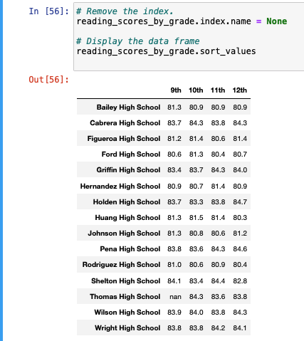

# School_District_Analysis
Week 4 Module 4 PyCitySchools with Pandas

## Overview of the school district analysis:
The purpose of this analysis was to replace the altered datat for Thomas High School and re-run the original analysis looking at the different schools in PyCity. This including looking at overall passing for reading and math by a few different splits such as by grade, school size, school budget, and school type to see if there were any patterns that can help determine where students would be most successful and where there was need for improvemnt. 

### How is the district summary affected?
After Thomas High School was removed, most of the average scores fell by 0.1 - 0.3 percentage points with the biggest impact to the overall passing percentage that went from 65.2% to 64.9%.  Although both codes look identical, after Thomas High School was removed (Revised District Summary), it was simpler to reuse the previous code that already existed to re-run the data frame and reformat, but that the display of the data frame is slightly different confirms that there was a change in the data.  Also, we know from running the student data count that there was over 39,000 students in all of the schools for the PyCity School data  with only 461 students affected for Thomas High School 9th grade. If we divide the Thomas High School 9th graders (461) by the total number of students in all schools (39,170), that works out to 1.17% which is why the scores didn’t change by much. If Thomas High School 9th graders made up a larger proportion of the students, the removal of their data would have caused a larger fluctuation.  

**Original District Summary:**

**Revised District Summary:**

### How is the school summary affected?
While overall, the revised Thomas High School data did not have much impact, it did on the individual school level. Originally, Thomas High School was the second highest overall passing school in the original data frame, but once the 9th graders were removed, the school fell to the 8th highest overall passing, falling from 90.95% to 65.08%. The removal of the 9th graders scores heavily impacted Thomas High School’s passing rate, but not enough to send them to the very bottom of the list which means that even without 9th grade’s inflated scores, Thomas’s high school students’ are not less likely to get a passing grade. 

**Original School Summary:**

**Revised School Summary:**

### How does replacing the ninth graders’ math and reading scores affect Thomas High School’s performance relative to the other schools?
**Math Scores by Grade**  
In the original data frame, Thomas High School was third highest school among 9th graders. After the 9th graders were removed and the score was replaced with NaN, the lost their position.  The other grades for Thomas High School were not affected and they continue to be seventh place for 10th graders, fifth place for 11th graders and fourth place among 12th graders. While they do not have the very highest average for math scores by grade, they tend to be a school close to the median scores for each grade with the 12th graders being highest compared to the other schools, but the average math score for Thomas High School’ s 11th and 12th graders are nearly identical at 83.5 for both grades.  
  
 
   * Math Score by Grade Original  
       
   * Math Score by Grade Challenge  
     
    

  **Reading Score by grade**   
  
Thomas High School 9th graders had the fourth highest average among the schools before their data was cleaned out. Similar to the Math score averages, the other grades were not affected after the 9th grade data clean for Thomas. Thomas High School is tied with Caberera High School for the average reading score for 10th graders, but has the seventh highest average reading score for their 11th and 12th graders. This tells us that even though the Thomas High School 9th graders were helping increase Thomas’s overall position compared to other schools, their 10th grade reading scores are also contributing. 

   * Reading Score by Grade Original  
       
   * Reading Score by Grade Challenge  
    

  
 **Scores by school spending**   
 
 Although Thomas High School 9th graders were removed, the spending buckets included were large enough that the impact was minimal at best, affecting the hundreths of a decimal place.  Re-running the dataframe looked identical unless looking at it unformatted to spot the differences. I can confidentally say at a topline level that removing Thomas High School's 9th graders did not affect the scores by school spending. What I can tell from looking at the school by spend is that  Thomas High School was in the $630-644 range since that was the only row to show the hundredth decimal place changes. 
 
   * Original Scores by Spend  
       
   * Challenge Scores by Spend  
       

  **Scores by school size**   
   * Original Scores by Size  
       
   * Challenge Scores by Size  
       
     
  **Scores by school type**   
   * Original Scores by Type  
       
   * Challenge Scores by Type  
       

## Summary: Summarize four major changes in the updated school district analysis after reading and math scores for the ninth grade at Thomas High School have been replaced with NaNs.

