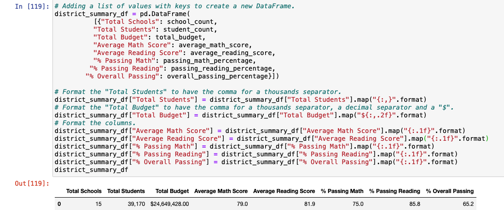

# School_District_Analysis
Week 4 Module 4 PyCitySchools with Pandas

## Overview of the school district analysis:
The purpose of this analysis was to replace the altered datat for Thomas High School and re-run the original analysis looking at the different schools in PyCity. This including looking at overall passing for reading and math by a few different splits such as by grade, school size, school budget, and school type to see if there were any patterns that can help determine where students would be most successful and where there was need for improvemnt. 

### How is the district summary affected?
After the Thomas High School 9th grade scores were removed from the data set, 

Original District Summary:

Revised District Summary:

### How is the school summary affected?
type analysis here

Original School Summary:

Revised District Summary:

### How does replacing the ninth graders’ math and reading scores affect Thomas High School’s performance relative to the other schools?
  - Math and reading scores by grade
  - Scores by school spending
  - Scores by school size
  - Scores by school type

## Summary: Summarize four major changes in the updated school district analysis after reading and math scores for the ninth grade at Thomas High School have been replaced with NaNs.
